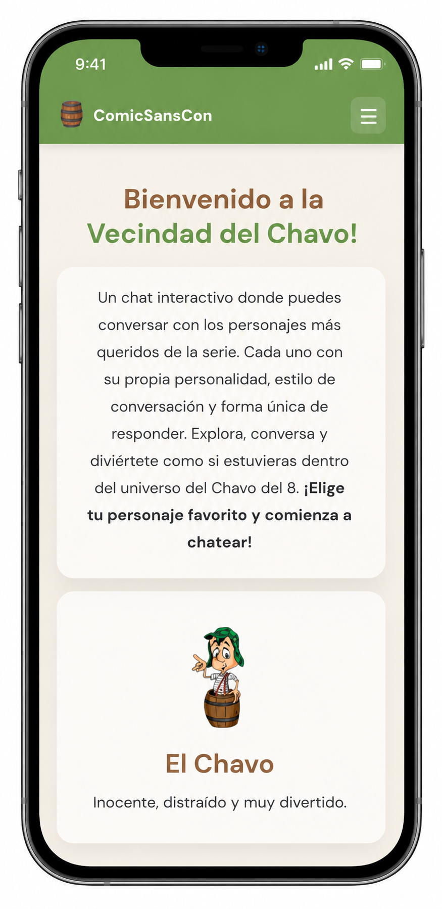
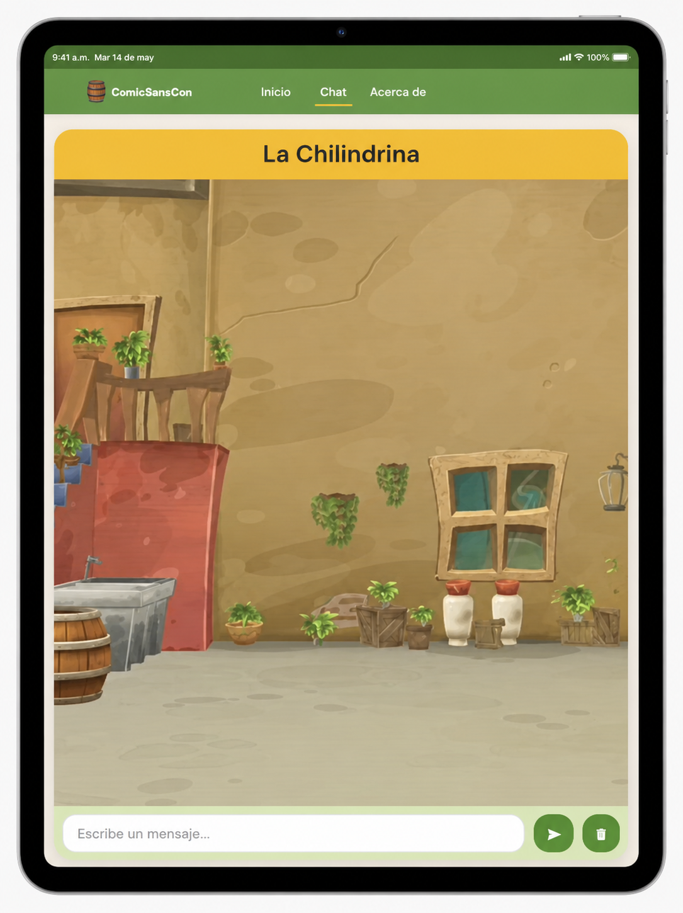
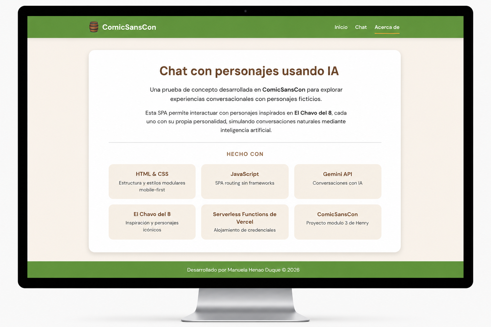

# 🛢️ ComicSansCon AI

Una SPA de chat interactivo donde puedes conversar con los personajes más queridos de **El Chavo del 8**, cada uno impulsado por inteligencia artificial con su propia personalidad y forma de hablar.

🔗 **App desplegada:** [https://proyecto-m3-manuela-henao.vercel.app/](https://proyecto-m3-manuela-henao.vercel.app/)

---

## 🎭 Personajes

### El Chavo del 8
Niño inocente y distraído que vive en un barril en la vecindad. Habla de forma simple y literal, se confunde con facilidad y siempre tiene hambre. Sus frases más famosas como *"fue sin querer queriendo"* y *"yo no fui"* aparecen naturalmente en la conversación.

### La Chilindrina
Hija de Don Ramón. Traviesa, inteligente y muy habladora. Usa sarcasmo ligero, se hace la víctima dramáticamente y llama a su papá cuando la situación se pone difícil. En el fondo tiene cariño por todos.

### Quico
Hijo de Doña Florinda. El niño más mimado de la vecindad. Presume constantemente sus juguetes y todo lo que tiene *"es el mejor del mundo mundial"*. Se enoja rápido pero se le pasa igual de rápido si alguien lo halaga.

---

## 🖼️ Capturas de pantalla

> Reemplaza las imágenes con tus capturas reales.

| Inicio | Chat | Acerca de |
|--------|------|-----------|
|  |  |  |

---

## ⚙️ Requisitos

- Node.js 18+
- Cuenta en [Google AI Studio](https://aistudio.google.com/) para obtener una `GEMINI_API_KEY`
- [Vercel CLI](https://vercel.com/docs/cli) instalado globalmente

```bash
npm install -g vercel
```

---

## 🚀 Ejecutar en local

### 1. Clonar el repositorio

```bash
git clone https://github.com/manuelahenaod/ProyectoM3_ManuelaHenaoDuque-.git
cd ProyectoM3_ManuelaHenaoDuque-
```

### 2. Instalar dependencias

```bash
npm install
```

### 3. Configurar variables de entorno

Crea un archivo `.env` en la raíz del proyecto:

```env
GEMINI_API_KEY=tu_api_key_aqui
```

> Obtén tu API key gratis en [https://aistudio.google.com/app/apikey](https://aistudio.google.com/app/apikey)

### 4. Ejecutar en local

```bash
vercel dev
```

La app estará disponible en [http://localhost:3000](http://localhost:3000)

---

## 🧪 Ejecutar tests

```bash
npm run test
```

---

## 🌐 Desplegar a Vercel

### Primera vez

```bash
vercel
```

Sigue las instrucciones del CLI. Cuando te pregunte por variables de entorno, agrega `GEMINI_API_KEY`.

### Despliegues posteriores

```bash
vercel --prod
```

También puedes conectar el repositorio directamente desde el [dashboard de Vercel](https://vercel.com/dashboard) para que cada push a `main` despliegue automáticamente.

> **Importante:** asegúrate de configurar `GEMINI_API_KEY` en *Settings → Environment Variables* dentro de tu proyecto en Vercel.

---

## 🤖 Registro de uso de IA

Este proyecto usa inteligencia artificial en dos niveles:

### En la aplicación
- **Google Gemini API** (`gemini-3.1-flash-lite`) como motor de conversación. Cada personaje tiene un system prompt personalizado que define su voz, sus frases características y cómo reacciona a distintos temas.
- La temperatura del modelo se configuró en `1.0` con `topP: 0.95` para lograr respuestas más naturales y menos repetitivas.

### En el desarrollo
- **Claude (Anthropic)** se usó como asistente de desarrollo para:
  - Modularizar y organizar la arquitectura CSS en capas (base, componentes, vistas, responsive)
  - Implementar el diseño mobile-first y resolver problemas de layout con flexbox
  - Mejorar los system prompts de los personajes para que respondieran con más personalidad
  - Definir la paleta de colores terracota del proyecto

---

## 🛠️ Stack técnico

| Tecnología | Uso |
|-----------|-----|
| HTML + CSS modular | Estructura y estilos mobile-first |
| JavaScript vanilla | SPA routing sin frameworks |
| Google Gemini API | Motor de conversación con IA |
| Vercel Serverless Functions | Backend para llamadas a la API |
| Vercel | Hosting y despliegue |

---

## 👩‍💻 Autora

Desarrollado por **Manuela Henao Duque** · ComicSansCon 2026